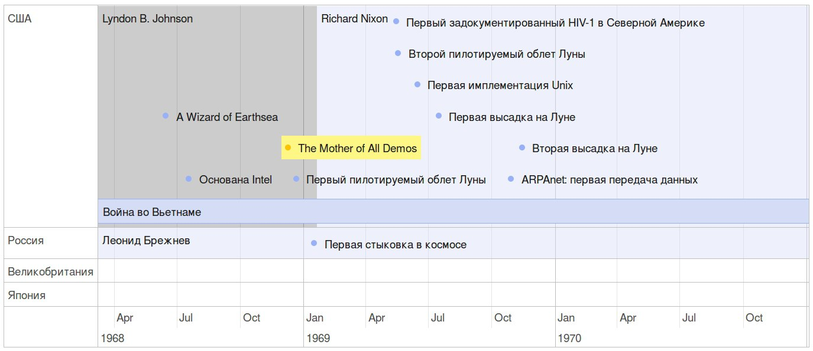
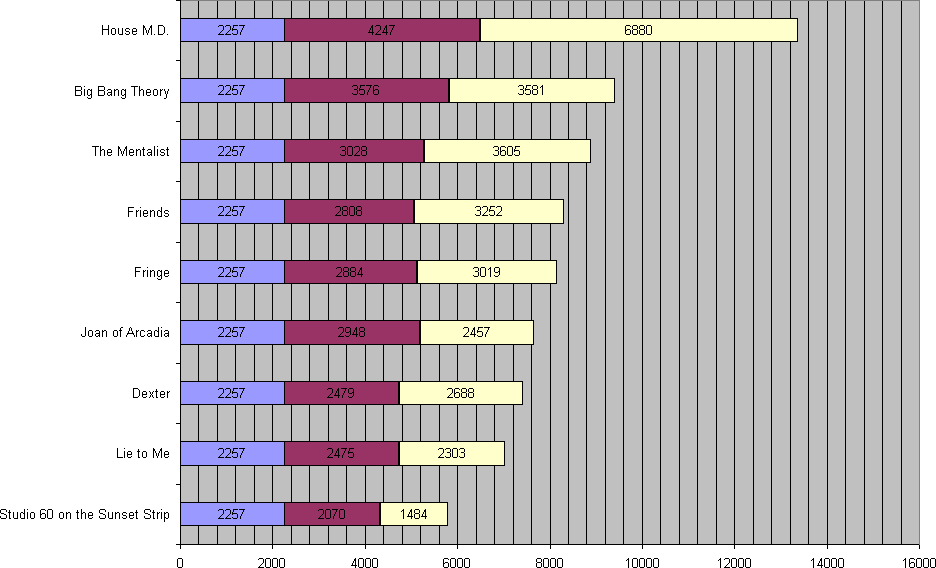

<h2>Table of Contents</h2>

<ul>
<li><a href="#orgheadline1">1. Предпосылки</a></li>
<li><a href="#orgheadline10">2. Задачи инфоорга</a>
<ul>
<li><a href="#orgheadline2">2.1. Захват</a></li>
<li><a href="#orgheadline3">2.2. Идентификация</a></li>
<li><a href="#orgheadline4">2.3. Хранение</a></li>
<li><a href="#orgheadline5">2.4. Классификация</a></li>
<li><a href="#orgheadline6">2.5. Структурирование</a></li>
<li><a href="#orgheadline7">2.6. Поиск</a></li>
<li><a href="#orgheadline8">2.7. Аннотирование</a></li>
<li><a href="#orgheadline9">2.8. Переносимость</a></li>
</ul>
</li>
<li><a href="#orgheadline40">3. Чего мне хочется от информационного менеджера</a>
<ul>
<li><a href="#orgheadline11">3.1. Оглавления для источников</a></li>
<li><a href="#orgheadline18">3.2. Цитатник</a>
<ul>
<li><a href="#orgheadline12">3.2.1. Привязка цитат к оглавлению книги</a></li>
<li><a href="#orgheadline13">3.2.2. Заголовки для цитат</a></li>
<li><a href="#orgheadline14">3.2.3. Параллельные цитатники</a></li>
<li><a href="#orgheadline15">3.2.4. Колоды</a></li>
<li><a href="#orgheadline16">3.2.5. Рифмы</a></li>
<li><a href="#orgheadline17">3.2.6. Компартментализм</a></li>
</ul>
</li>
<li><a href="#orgheadline19">3.3. События</a></li>
<li><a href="#orgheadline22">3.4. Словарь</a>
<ul>
<li><a href="#orgheadline20">3.4.1. Личный словарь терминов</a></li>
<li><a href="#orgheadline21">3.4.2. Словарь иностранных слов</a></li>
</ul>
</li>
<li><a href="#orgheadline30">3.5. Контекст</a>
<ul>
<li><a href="#orgheadline23">3.5.1. Заголовочный блок</a></li>
<li><a href="#orgheadline24">3.5.2. Форма быстрого поста</a></li>
<li><a href="#orgheadline25">3.5.3. Хвост</a></li>
<li><a href="#orgheadline26">3.5.4. Контекст есть у каждого ресурса</a></li>
<li><a href="#orgheadline27">3.5.5. Контекст как строительный блок интерфейса</a></li>
<li><a href="#orgheadline28">3.5.6. Динамическое дерево как вложенные контексты</a></li>
<li><a href="#orgheadline29">3.5.7. Вопросы</a></li>
</ul>
</li>
<li><a href="#orgheadline31">3.6. Параллельные тексты</a></li>
<li><a href="#orgheadline34">3.7. Блочный текстовый редактор</a>
<ul>
<li><a href="#orgheadline32">3.7.1. Зачем бить на блочные элементы</a></li>
<li><a href="#orgheadline33">3.7.2. Post with input/output</a></li>
</ul>
</li>
<li><a href="#orgheadline35">3.8. Импорт данных из веб-сервисов</a></li>
<li><a href="#orgheadline39">3.9. Динамические деревья</a>
<ul>
<li><a href="#orgheadline36">3.9.1. Проблемы иерархических файловых систем</a></li>
<li><a href="#orgheadline37">3.9.2. Замена одного дерево на множество</a></li>
<li><a href="#orgheadline38">3.9.3. Сохранение файловой семантики</a></li>
</ul>
</li>
</ul>
</li>
<li><a href="#orgheadline49">4. Поиск подхода к реализации</a>
<ul>
<li><a href="#orgheadline43">4.1. Декомпозиция</a>
<ul>
<li><a href="#orgheadline41">4.1.1. Блог</a></li>
<li><a href="#orgheadline42">4.1.2. Оценка количества триплетов при импорте книги</a></li>
</ul>
</li>
<li><a href="#orgheadline48">4.2. Базовые определения</a>
<ul>
<li><a href="#orgheadline44">4.2.1. Ресурс</a></li>
<li><a href="#orgheadline45">4.2.2. Представление</a></li>
<li><a href="#orgheadline46">4.2.3. Атрибут</a></li>
<li><a href="#orgheadline47">4.2.4. Адаптер</a></li>
</ul>
</li>
</ul>
</li>
<li><a href="#orgheadline58">5. Как это все может выглядеть на практике</a>
<ul>
<li><a href="#orgheadline52">5.1. Реляционный подход</a>
<ul>
<li><a href="#orgheadline50">5.1.1. Конспект</a></li>
<li><a href="#orgheadline51">5.1.2. Цитаты, разложенные по главам</a></li>
</ul>
</li>
<li><a href="#orgheadline53">5.2. Обычный реляционный подход + наведенная семантика</a></li>
<li><a href="#orgheadline56">5.3. Семантика</a>
<ul>
<li><a href="#orgheadline54">5.3.1. OpenLink Virtuoso</a></li>
<li><a href="#orgheadline55">5.3.2. AllegroGraph</a></li>
</ul>
</li>
<li><a href="#orgheadline57">5.4. Графовая база данных</a></li>
</ul>
</li>
<li><a href="#orgheadline81">6. История</a>
<ul>
<li><a href="#orgheadline59">6.1. Vannevar Bush — As We May Think (1945)</a></li>
<li><a href="#orgheadline60">6.2. Douglas Engelbart — The Mother of All Demos (1968)</a></li>
<li><a href="#orgheadline61">6.3. Gifford — Semantic file systems (1991)</a></li>
<li><a href="#orgheadline62">6.4. Eric Kim — Purple (2001)</a></li>
<li><a href="#orgheadline63">6.5. Joshua Schachter — Del.icio.us (2003)</a></li>
<li><a href="#orgheadline64">6.6. W3C — RDF / RDFS / OWL (2004)</a></li>
<li><a href="#orgheadline65">6.7. MusicBrainz</a></li>
<li><a href="#orgheadline66">6.8. Org-mode</a></li>
<li><a href="#orgheadline67">6.9. Fluidinfo</a></li>
<li><a href="#orgheadline68">6.10. Calibre</a></li>
<li><a href="#orgheadline69">6.11. Ginko</a></li>
<li><a href="#orgheadline70">6.12. Smallest Federated Wiki</a></li>
<li><a href="#orgheadline71">6.13. Chandler</a></li>
<li><a href="#orgheadline72">6.14. CommonTag (dead)</a></li>
<li><a href="#orgheadline73">6.15. Friendfeed (dead)</a></li>
<li><a href="#orgheadline74">6.16. Locker (dead)</a></li>
<li><a href="#orgheadline75">6.17. Singly (dead)</a></li>
<li><a href="#orgheadline76">6.18. vk.com/audio</a></li>
<li><a href="#orgheadline77">6.19. NEPOMUK (framework)</a></li>
<li><a href="#orgheadline78">6.20. TiddlyWiki</a></li>
<li><a href="#orgheadline79">6.21. Scrivener</a></li>
<li><a href="#orgheadline80">6.22. Tinderbox</a></li>
</ul>
</li>
<li><a href="#orgheadline94">7. Ссылки</a>
<ul>
<li><a href="#orgheadline82">7.1. Учебные заведения</a></li>
<li><a href="#orgheadline83">7.2. Термины</a></li>
<li><a href="#orgheadline84">7.3. Люди</a></li>
<li><a href="#orgheadline85">7.4. Книги</a></li>
<li><a href="#orgheadline87">7.5. Ассоциации</a>
<ul>
<li><a href="#orgheadline86">7.5.1. Association for Information Science and Technology</a></li>
</ul>
</li>
<li><a href="#orgheadline91">7.6. urbansheep</a>
<ul>
<li><a href="#orgheadline88">7.6.1. LiveJournal</a></li>
<li><a href="#orgheadline89">7.6.2. FriendFeed</a></li>
<li><a href="#orgheadline90">7.6.3. Pinboard</a></li>
</ul>
</li>
<li><a href="#orgheadline93">7.7. Конференции</a>
<ul>
<li><a href="#orgheadline92">7.7.1. Personal Digital Archiving Conference</a></li>
</ul>
</li>
</ul>
</li>
</ul>

# Предпосылки

Человеческая память ограничена. Поэтому нужен инструмент чтобы
запоминать нужное, забывать бесполезное и наводить порядок в голове.

Нет никакого решения для всех. Поэтому решением является инструмент
для создания решений.

# Задачи инфоорга

Сначала я выпишу задачи, которые решает любая система по хранению
данных, чтобы потом можно было ссылаться на эти термины.

Задачи инфоорга решаются последовательно. Если нет захвата, нечего
идентифицировать. Если нет идентификации, не к чему привязывать
классификацию.

Каждый слой представляет абстракцию для других слоев.

> И вот смотрю я на Singly и на предшествующий ему Memolane и до меня
> начинает доходить, что веб-сервисы еще не прошли тот этап, который
> для меня закончился — этап собирания разных данных в одно место. У
> меня были записи в разных форматах, в том числе несколько
> тетрадок. Тетрадки я оцифровал, форматы поубивал, заменив
> текстовыми файлами. Теперь у меня все лежит в одном месте в одном
> формате. Теперь все это можно как-то автоматически обрабатывать. В
> интернете этого еще не произошло, здесь все только начинается.

## Захват

Как данные попадают в систему?

Захват &#x2013; это больше про интерфейс

Keeping is not organizing.

Захват должен сохранять контекст.

Захват должен стоить 0. False positive keeping должен умереть. Если
захват стоит ноль, значит сохранять надо все что почесало мозг. Мы
не знаем зачем сохраняем.

Компьютер знает о нас очень много. Все что может быть захвачено
автоматически должно захватываться автоматически.

## Идентификация

Как адресовать отдельный элемент в системе?

Номеров страниц как в книгах больше нет, что делать?

Идентификация отделяет слой классификации от слоя хранения. После
того, как элемент добавлен в систему, ему пресваивается UUID и
классификация осуществлется уже над UUID. Нельзя классифицировать
прямые пути в файловую систему. Если файл перенести в другое
место, метаданные, прикрепленные к этому файлу, будут ссылаться на
пустое место.

Системе должно быть безразлично не только что именно она
описывает, но и где оно лежит. Хранение должно быть отделено от
доступа.

Есть необходимость идентифицировать не только отдельные документы,
но и части этих документов.

## Хранение

В каком формате хранить информацию из различных источников? 

Хочется унифицированности.

## Классификация

Как описывать объекты хранящиеся в системе?

[Онтологии](https://en.wikipedia.org/wiki/Ontology_(information_science)).

Системе должно быть безразлично не только что именно она
описывает, но и где оно лежит. Хранение должно быть отделено от
доступа.

Не все файлы нуждаются в семантике. Целая куча постоянно
скачивается, просматривается и удаляется. Нет никакого смысла
наводить на них семантику, кроме может быть примитивной
машинной. Те файлы, которые должны быть упорядочены, должны лежать
в семантическом, тщательно структурируемом хранилище. Все
остальное пускай лежит как раньше.

## Структурирование

В какие структуры объединяются ресурсы?

Группировка и сортировка.

Структура информации являются функцией от ее объема. Как только
меняется объем, структуре приходится его догонять. В одной папке с 10
файлами легко найти нужный, в одной папке с 1000 файлами уже не
очень. С другой стороны, эта 1000 файлов отсортирована по какому-то
признаку, там снова можно ориентироваться.

Сохраненные запросы / Деревья / Контексты

## Поиск

Как искать нужную информацию в массиве?

> На больших объемах информации поиск итеративен и разные "мили"
> проходятся разными способами. Полнотекстовый поиск, сохраненные
> запросы и обычный иерархический подход будут мирно сосуществовать
> на машинах.

## Аннотирование

Как хранить и связывать аннотации с сохраненными ресурсами?

Как аннотировать текст?

Как аннотировать аудио-файлы?

Как аннотировать видео?

Как аннотировать обновляющийся источник? Обновляющийся источник
сложно аннотировать. Какие-то части появляются, какие-то
попадают. Последовательная нумерациия параграфов невозможна, потому
что она будет ломаться каждую версию. Значит адресовать нужно по
uuid.

Аннотирование в самом простом случае &#x2013; это комментирование. 

Удобство аннотирования &#x2013; это аргумент в пользу блочной
идентификации. Можно добавлять комментарии к каждому параграфу.

## Переносимость

Я готов вбивать руками семантику на весь свой массив данных, но
только при одном условии: чтобы мне больше никогда не приходилось
это делать.

# Чего мне хочется от информационного менеджера

## Оглавления для источников

В идеале книги должны импортироваться внутрь, биться на блочные
элементы и цитаты должны привязываться непосредственно к тому
пераграфу, откуда она была вытащена. Но это непростая операция,
даже если на входе epub.

Поэтому делается упрощенный вариант: от книги оставляется скелет
в виде оглавления.

Речь про то, что должен быть выбор: либо источник создается без
оглавления, либо есть оглавление, либо полный импорт.

Как достать оглавление:

-   [PDF](https://stackoverflow.com/questions/2431426/extract-toc-of-pdf)
-   [EPUB](http://www.idpf.org/accessibility/guidelines/content/nav/toc.php) (здесь это xml-файл, лежащий в архиве)
-   FictionBook (опять xml)

## Цитатник

### Привязка цитат к оглавлению книги

Цитаты привязываются к оглавлению источника. 

### Заголовки для цитат

Простая фича, но мне ее не хватает (например в tumbler). Обычно я
делаю заголовки в формате "#{автор} про #{тема}".

### Параллельные цитатники

Параллельные цитатники позволяют отображать версии одной и той же
цитаты на разных языках. Напрмер чтобы сравнивать перевод и
оригинал. Цитата по-прежнему является отдельной сущностью и
крепится к оглавлению.

[Пример параллельного цитатника](https://htmlpreview.github.io/?https://github.com/teksisto/timeline/blob/master/misc/parallel_quotes/quotes.html) из книги Пирсига "Дзен и искусство
ухода за мотоциклом". Поскольку не существует электронной версии
перевода Горшкова я выписывал русские аналоги только для коротких
цитат.

### Колоды

Колоды из цитат. Я называю это колодами, потому что когда-то
печатал цитаты на карточках. Получалось что-то вроде карточной
колоды. На самом деле это просто возможноть объединить
произвольные цитаты в группу и добавить к ней описание.

### Рифмы

Если долго собирать цитаты между ними начинают проглядывать
параллели. Есть мнение что люди часто говорят про одни и те же
вещи, просто называют их по-разному. Хотелось бы помечать такие
находки в цитатнике связями, а потом обсуждать и оценивать
такие связи.

Похожесть цитат не обязательно транизитивное свойство, но
предполагаю, что для нескольких человек на относительно больших
наборах цитат будут находится не только пары, но цепочки из цитат.

> Reed College at that time offered perhaps the best calligraphy
> instruction in the country. Throughout the campus every poster,
> every label on every drawer, was beautifully hand
> calligraphed. Because I had dropped out and didn't have to take
> the normal classes, I decided to take a calligraphy class to learn
> how to do this. I learned about serif and san serif typefaces,
> about varying the amount of space between different letter
> combinations, about what makes great typography great. It was
> beautiful, historical, artistically subtle in a way that science
> can't capture, and I found it fascinating.
> 
> None of this had even a hope of any practical application in my
> life. But ten years later, when we were designing the first Macintosh
> computer, it all came back to me. And we designed it all into the
> Mac. It was the first computer with beautiful typography. If I had
> never dropped in on that single course in college, the "Mac" would
> have never had multiple typefaces or proportionally spaced fonts. And
> since Windows just copied the Mac, it's likely that no personal
> computer would have them. If I had never dropped out, I would have
> never dropped in on that calligraphy class, and personal computers
> might not have the wonderful typography that they do. Of course it was
> impossible to connect the dots looking forward when I was in
> college. But it was very, very clear looking backwards 10 years later.
> Again, **you can't connect the dots looking forward**;
> you can only connect them looking backwards. So you have to trust that
> the dots will somehow connect in your future. You have to trust in
> something – your gut, destiny, life, karma, whatever – because
> believing that the dots will connect down the road will give you the
> confidence to follow your heart, even when it leads you off the
> well-worn path, and that will make all the difference. 
> 
> (Steve Jobs, [Commencement Address at Stanford University](http://www.americanrhetoric.com/speeches/stevejobsstanfordcommencement.htm))

> What you’re supposed to do in most freshman-rhetoric courses is to
> read a little essay or short story, discuss how the writer has done
> certain little things to achieve certain little effects, and then have
> the students write an imitative little essay or short story to see if
> they can do the same little things. He tried this over and over again
> but it never jelled. The students seldom achieved anything, as a
> result of this calculated mimicry, that was remotely close to the
> models he’d given them. More often their writing got worse. It seemed
> as though every rule he honestly tried to discover with them and learn
> with them was so full of exceptions and contradictions and
> qualifications and confusions that he wished he’d never come across
> the rule in the first place.
> 
> A student would always ask how the rule would apply in a certain
> special circumstance. Phædrus would then have the choice of trying to
> fake through a made-up explanation of how it worked, or follow the
> selfless route and say what he really thought. And what he really
> thought was that **the rule was pasted on to the writing after
> the writing was all done**. It was post hoc, after the fact,
> instead of prior to the fact.
> 
> (Robert M. Pirsig, [Zen and the Art of Motorcycle Maintenance](http://design.caltech.edu/Misc/pirsig.html))

### Компартментализм

Термин из психологии. По-русски обычно переводят как "раздельное
мышление". Типовые примеры из википедии: чудеса гуманизма в
общественной деятельности, сочетающиеся с домашним насилием и
жестокостью; борьба с порнографией, сочетающаяся с обширной
домашней коллекцией порно.

Если долго собирать цитаты, в них начинают появляться
противоположные. Иногда один и тот же человек с течением времени
высказывает противоположные взгляды (это нормально, он растет и
меняется).

Идея игра в том, что брать цитаты из разных мест и укладывать их в
два столбика &#x2013; за и против. Потом смотреть на то, как по любому
вопросу есть две противоположных точки зрения, представленные
вполне убедительными людьми. Может быть даже в три столбика: за,
против и синтез &#x2013; но попыток синтеза вокруг очень мало. Хотя идея
"срединного пути" совсем не нова, и была озвучена как упоротыми
изотериками, так и психотерапевтами.

Я дошел до этой игры сам, но позже обнаружил, что уже есть сервис
реализующий похожий подход &#x2013; lovehate.ru. Там обитает много
школьников, что конечно его портит.

Играть в эту игру можно просто с самим собой, находя противоречия
как в себе, так и в окружающем мире. Но есть и вторая цель &#x2013;
сделать какой-то аналог [дискуссионного клуба](https://en.wikipedia.org/wiki/Debate#Student_debating_societies). Сбор best arguments,
за и против какой-нибудь идеи.

Конечная цель игры &#x2013; синтез разных мнений.

> Раздельное мышление — это защитный механизм,
> позволяющий человеку умещать в себе логически несовместимые
> установки. Если по каким-то причинам человек нуждается в каждой из
> своих несовместимых установок, то осознание возникающего
> противоречия начинает занимать мысли попытками это противоречие
> разрешить (зачастую с помощью рационализаций). Чтобы этого не
> происходило, человек может начать «раздельно мыслить» — не
> осознавая противоречия между ними, придерживаться всех
> несовместимых установок сразу. Со стороны это выглядит как простое
> лицемерие, но сам человек в этом случае придерживается своих
> установок вполне искренне, хотя и использует в каждом конкретном
> случае только одну из них. 
> 
> (Википедия, Мак-Вильямс)

> Настоящий спор, говорю тебе из лагерного опыта, производится
> как поединок. По согласию выбираем посредника &#x2013; хоть Глеба
> сейчас позовем.  Берем лист бумаги, делим его отвесной чертой
> пополам. Наверху, через весь лист, пишем содержание
> спора. Затем, каждый на своей половине, предельно ясно и
> кратко, выражаем свою точку зрения на поставленный
> вопрос. Чтобы не было случайной ошибки в подборе слова &#x2013;
> время на эту запись не ограничивается. [&#x2026;] Пустые
> словопрения и сотрясения воздуха могут тянуться неделями. А
> спор на бумаге иногда кончается в десять минут: сразу же
> становится очевидно, что противники или говорят о совершенно
> разных вещах или ни в чем не расходятся. Когда же выявляется
> смысл продолжать спор &#x2013; начинают поочередно записывать доводы
> на своих половинках листа. 
> 
> (Солженицин, "В круге первом")

## События

Я прочитал несколько книг про историю компьютеров и сетей и понял,
к моменту прочтения последней, я уже не могу сопоставить даты,
которые мне описывают сейчас, с датами, которые были описаны в
предыдущих книгах. Было бы круто наложить последовательности
событий друг на друга и показать это все на таймлайне.

Проблема в том, что когда я слышу, что "Хоббит" был опубликован в
1937 году, я уже давно забыл, что в том же году вышла первая
диснеевская полнометражка. События, даты которых я слышу, для меня
находятся в вакууме. Если их выписывать, то со временем контекста
будет становится все больше.

Так же это здорово прочищает мозг, потому что выясняется с какой
легкостью я ошибаюсь на плюс-минус десять лет в интуитивной оценке,
когда что-то произошло.

Кое-как, но события сейчас реализованы. Их можно добавлять,
разглядывать на таймлайне через [vis.js](http://visjs.org), и крепить вместе с цитатами
к оглавлению книги.

## Словарь

### Личный словарь терминов

Карточки для терминов, встреченных в тексте. Крепятся к
оглавлению. Автоматически генерируют ссылки на запрос в гугл и
википедию.

### Словарь иностранных слов

Например берем субтитры на английском, тупо режем их на слова и
удаляем всякий очевидный мусор. Прикручиваем [WordNet](https://wordnet.princeton.edu/). Удаляем
множественные числа, превосходные степени, глагольные формы,
междометия, предлоги и местоимения. Считаем частотность. Находим
самые частовстречающиеся 2000 слов (["core vocabulary"](https://en.wikipedia.org/wiki/Basic_English)). Делаем
интерфейс, в котором пользователь может отметить знает он это
слово или не знает (там не надо думать, если сомневаешься,
говоришь, что не знаешь). На вычитку 1000 слов у меня уходило
меньше часа. Предположим, что средний словарный запас у
англоговорящего 20-30k слов, у того кто учит язык &#x2013; сильно
меньше. За 10-20 часов систему можно научить всем словам, которые
ты знаешь. По сравнению со временем обучения языку это очень мало.

Ок, на выходе мы получили список слов. Что теперь с ним можно
поделать? 

Во-первых, можно прогнать свежий текст через базу и найти слова,
которых ты не знаешь. Если прикрутить [treat](https://github.com/louismullie/treat), то еще и с частью
речи. Теперь можно автоматом генерить из них карточки для
запоминания, в которых будет учитываться часть речи ("мне
встречалось это слово как глагол, а тут оно как существительное"),
автоматически добавляться пример в котором слово попалось и будет
стоять ссылка на конретный источник, откуда слово взялось. Это
очень круто, потому что руками делать карточки вымораживает. Из
упоротых идей: можно скриншот делать из видео, где это слово
показыватеся.

Во-вторых, можно оценивать лексическую сложность текста до
прочтения.

На картинке синяя часть полоски &#x2013; это базовая лексика, красная &#x2013;
слова, которые повторяются два и больше раз, и желтая &#x2013; слова,
которые встречаются в сериале один раз.

## Контекст

Контекст нужен для объединения ресурсов в одно целое и показывает
хронологию развития какой-то темы. Контекст по природе
гетерогенен. Он может захватывать ссылки, картинки, посты, ресурсы
любого типа.

Контекст &#x2013; это легковестный блог с вики-страницей в заголовке. 

-   Он предназначен либо для мелкого собирательства, которое возможно
    перератет во что-то большее (например в заметку). Тогда заметка
    должна стать хедом.

-   Либо для подборки однотипных высказываний (рифмы из цитат). Хотя их можно
    делать и коммуникативными связями.

-   Крупномаштабный харвест всего встреченного на пути по интересной теме.

На что это похоже: 

-   tumbler &#x2013; множество блогов у одного пользователя. Маленькие
    блоги на какую-нибудь обскурную тему, в которых есть два поста и
    новые появляются раз в год.
-   redmine &#x2013; страница версии. Там в заголовке вики-страница, а в
    хвосте автоматичекий список задач из спринта, разбитых по типу
    работ.

Атрибуты:

-   название
-   заголовочный блок
-   запрос, определяющий хвост
-   хвост = массив ресурсов

### Заголовочный блок

Заголовочный блок может использоваться как summary или описание
того, зачем контекст нужен.

Так же его можно использовать для агрегирования данных из
элементов хвоста. Например контекст в который входят все
поступления/расходы за месяц может показывать в заголовке как
менялась сумма денег в кошельке.

Если контекст используется для создания категории постов, то есть
как тег, то он дает некоторые преимущества. Маркер контекста может
быть любым (хоть uuid). В то время как отображаться будет
нормальное название. В головном блоке можно писать что здесь лежит
и зачем.

### Форма быстрого поста

В контексте есть форма быстрого поста. Ты пишешь туда текст, а он
сам разбирается какие атрибуты ему проставить. Интересный вопрос:
как и чем из запроса можно выводить атрибуты, которые присущи новым
записям.

### Хвост

Хвост определяется запросом.

Контекст может захватывать ресурсы автоматически, если ему задать
правила. Все заметки, которые ссылаются на конкретного
человека. Все покупки. 

Контекст умеет показывать хвост в прямом и обратном хронологическом
порядках. Если я нахожу какой-то интересный блог в интернете, как
правило мне хочется читать его с начала.

### Контекст есть у каждого ресурса

Еще одно странное следствие, это то, что контекст есть у каждого
ресурса. То есть есть как минимум какой-то контекст по-умолчанию в
который входят:

-   все ресурсы, которые ссылаются на данный
-   все ресурсы на которые ссылается он сам.

В первом случае из множества триплетов, у которых на месте объекта
стоит данный ресурс, выбираются уникальные значения из столбца
субъектов.

### Контекст как строительный блок интерфейса

Получается, что контекст &#x2013; это один из основных строительных
блоков интерфейса. Потому что любые колекции (eg список
полученных/отправленных писем для человека) &#x2013; это фильтр, который
вытаскивает сущности из базы и показывает в хедере статистику.

### Динамическое дерево как вложенные контексты

Интересно, что дерево вложенных контекстов &#x2013; это и есть то самое
динамическое дерево про которое я еще не говорил.

Новые сущности просеиваются сначала сквозь фильтр первого
контекста, потом через фильтры вложенных контекстов и где-то
оседают. Механизм просеивания &#x2013; это детали реализации.

Еще раз. Контекст гетерогенен. Ему без разницы что засасывать,
потому что засасывает он ресурсы, адресуемые uuid. Поэтому ничто
не мешает ему содержать в себе другие контексты.

В этом случае, кстати, голова контекста является элементом,
отображаеммым в ленте контекста верхнего уровня. Не надо так же
забывать, что голова контекста &#x2013; это обычный ресурс и у него, как
и у любого друго ресурса могут быть разные вьюшки для
отображения. Что позволяет например ужать в графическом
представлении весь контекст до заголовка со ссылкой.

### Вопросы

**Чем отличается лента от структурированного документа?**

Ничем.

**Чем отличаются лента/дерево/контекст друг от друга? Интерфейсом?**

Ничем не отличаются. Да, интерфейсом.

## Параллельные тексты

Под текстом здесь понимается любая информация, упорядоченная
последовательно.

Примеры параллельных текстов: 

-   запись выступления и презентация
-   песня и ее текст
-   подкаст и трансрипт
-   фильм, аудио дорожки к нему и субтитры
-   цитата на двух языках
-   книга на двух языках

Есть утилиты, которые строят параллельные тексты на разных языках
автоматически. Например, параграф к параграфу. Как я предполагаю,
они делают это на основе грубого машинного перевода и вычисления
насколько параграфы идентичны.

-   [Abbyy Aligner](http://www.abbyy.com/aligner/)
-   [Supernova Aligner](http://www.supernova-soft.com/wpsite/products/text-aligner/create-parallel-text-for-language-lerning/)

Ссылки:

-   [Parallel text](https://en.wikipedia.org/wiki/Parallel_text)
-   [Обучение через чтение параллельных текстов](https://ru.wikipedia.org/wiki/%D0%9F%D0%B0%D1%80%D0%B0%D0%BB%D0%BB%D0%B5%D0%BB%D1%8C%D0%BD%D1%8B%D0%B9_%D1%82%D0%B5%D0%BA%D1%81%D1%82_(%D0%BC%D0%B5%D1%82%D0%BE%D0%B4%D0%B8%D0%BA%D0%B0_%D0%BE%D0%B1%D1%83%D1%87%D0%B5%D0%BD%D0%B8%D1%8F))
-   [Ted Nelson &#x2013; My parallel universe](http://ted.hyperland.com/myU/)

## Блочный текстовый редактор

За неимением лучшего описания блочного текстового редактора сошлюсь
пока на заметку Глеба Калинина ["Контент-менеджмент и
веб-публикации"](http://glebkalinin.ru/content-management-vs-web-publishing/).

### Зачем бить на блочные элементы

Удобство идентификации &#x2013; можно давать ссылку на конкретное место в
тексте. Например цитаты &#x2013; как пример производного ресурса &#x2013; могут
ссылаться на конкретное место, одкуда они были взяты. Возможность
поставить ссылку на что угодно, начиная от параграфа и элемента
списка до конкретной ячейки таблицы.

Удобство классификации &#x2013; можно навешивать атрибуты на что угодно. 

Удобство аннотирования &#x2013; к каждому параграфу можно добавить
аннотацию, например комментарий.

Разбивка на параграфы позволяет строить параллельные тексты. Если
параллелить две книги выглядит как сложная задача, то запараллелить
несколько переводов стихотворения или две цитаты &#x2013; это вполне
посильная задача даже для выполнения руками.

### Post with input/output

Ссылки на ресурсы, которые показывают что меня побудило написать
этот текст.

## Импорт данных из веб-сервисов

О плохом сервисе никто не знает, хороший закроется через 10
лет. Плохой сервис не отдает данные пользователям, хороший имеет
выгрузку данных и api. Но что с ними делать, если он все равно
закрылся? Интерфейс пропал. Что делать с несколькими
экспортированными наборами данных, если хочется единую ленту?

Примеры веб-сервисов, которые пытались делать единую ленту: Singly,
Locker, Memolane, FriendFeed. В настоящий момент все закрыты.

Помимо единой ленты есть еще проблема единых метаданных. Теги из
разных сервисов надо приводить к одному знаменателю.

## Динамические деревья

### Проблемы иерархических файловых систем

Главная проблема здесь в том, что хранение при таком подхода
совмещено с классификацией.

Обычные файловые системы устроены иерархически. В зависимости от
схемы классификации файл можно положить в разные папки. Проблемы
начинаются когда:

-   один и тот же файл можно положить в разные места.
-   изменился объем информации и схему надо детализировать
-   изменился подход и классификацию надо переделывать

Структура &#x2013; это функция от объема информации. Меняется объем &#x2013;
меняется структура.

### Замена одного дерево на множество

Предложение в том, чтобы отделить хранение от классификации и
создавать множество разных деревьев на основе запросов.

На что это похоже: примеры такого уже давно есть в нормальных
музыкальных плеерах, которые предлагают разнообразные способы
отображения коллекции.

### Сохранение файловой семантики

Обычная проблема каталогизаторов, например calibre, в том, что
доступ к структуре возможен только из интерфейса самого
приложения. Нельзя пойти в папку, соответствующую
`категория/подкатегория/тег` и открыть epub редактором.

Динамические деревья можно отобразить на файловую систему с помощью
[виртуальной файловой системы](https://en.wikipedia.org/wiki/Virtual_file_system). Под linux это [FUSE](https://en.wikipedia.org/wiki/Filesystem_in_Userspace) (биндинги для ruby
&#x2013; [rbusefs](https://github.com/lwoggardner/rfusefs), пример использования &#x2013; [бесконечные рандомные pdf)](https://gist.github.com/teksisto/f35447da6e8079cfbe93).
Таким образом, можно соблюсти обычную файловую семантику, что
позволит любым приложениям работать со структурой папок, которая
генерится запросом. 

Либо, чтобы не связываться с системным программированием, можно
использовать [WebDAV](https://en.wikipedia.org/wiki/WebDAV), монтировать веб-приложение как папку и снова
пользоваться ей как файловой системой.

# Поиск подхода к реализации

Самое вменяемое решение, которое я вижу &#x2013; это [RDF](https://en.wikipedia.org/wiki/Resource_Description_Framework). 

## Декомпозиция

### Блог

Представим себе блог, где каждый пост не является монолитом, а
собирается из кусочков-атомов. Каждый атом имеет уникальный
идентификатор, хранится отдельно и имеет свой набор
атрибутов. Каждый параграф, картинка, видео-ролик в посте – это
атом. Структура поста задается списком из уникальных идентификаторов
каждого атома, каждый из которых трансклюдится в пост. На каждый
параграф в посте можно сослаться, навесить атрибуты и добавить
комментарии.

Структура каждого комментария к посту повторяет его структуру. К
этому добавляется древовидный или линейный контейнер, который хранит
порядок комментариев.

Посты организуются в хронологическое дерево. Это может быть
стандартная схема год/месяц/день или какая-нибудь другая, например,
год/неделя/день. Деревьев может быть несколько, выбор определяется
удобством.

Какие элементы структуры имеем в результате?

-   атомы с атрибутами
-   линейный список для объединения атомов в посты
-   комментарии, каждый из которых повторяет структуру поста
-   дерево для комментариев
-   посты организуются в хронологическое дерево

Теперь отрезаем лишние сущности.

Между атомом и постом нет никакой разницы. Оба имеют уникальный
идентификатор и набор атрибутов. Разница только в том, что у поста
есть сложный атрибут, который хранит список входящих в него
атомов. Сущность, обладающую уникальным идентификатором, на которую
можно навесить атрибуты я дальше буду называть ресурсом.

Между деревом и линейным списком нет никакой разницы, поскольку
дерево – это просто список списков. Дерево комментариев – это список
списков, листьями которого являются ресурсы, содержащие комментарии.

Теперь у нас есть два вида ресурсов: посты и комментарии. На самом
деле, даже больше, потому что атомы тоже различаются – текст,
картинка, видео. Поскольку у нас есть несколько типов ресурсов,
логично ввести понятие тип ресурса. Определение ресурса расширяется
до сущности, у которой есть уникальный идентификатор, атрибуты и
тип. Тип – это такой же атрибут, как и дата создания, заголовок или
любая другая мета-информация. Отличает его только то, что он
является обязательным, поскольку без него мы не будем знать, как
обрабатывать ресурс. Допустим, мы генерируем на основе нашей
структуры html. Чтобы отобразить текстовый атом, надо преобразовать
содержащуюся в нем разметку (например markdown) в html, обернуть это
в div и отдать браузеру. Чтобы показать картинку, надо обернуть ее в
тег img и отдать браузеру. Разница в обработке закрепляется в виде
типа.

Атрибуты — это, строго говоря, тоже ресурсы, а линейные списки
создаются с помощью цепочек ресурсов, ссылающихся друг на друга. Так
что кроме ресурсов ничего особо и не остается, но атрибуты и
линейные списки мы выкидывать пока не будем, а то говорить не о чем
будет.

Итак, у нас остались:

-   ресурсы
-   атрибуты
-   линейные списки

Переводим в термины rdf:

-   ресурс по-прежнему остается ресурсом (rdf:Resource)
-   атрибуты в терминологии rdf называются rdf:property
-   атрибут «тип ресурса» – это rdf:type
-   ресурсы, описывающие атрибуты, имеют rdf:type равным rdf:Property

Схема получается довольно заманчивая, потому что в базе данных все
поместится в две таблицы: одна для графа и одна для сопоставления
идентификаторов атомов и все было бы хорошо, если бы речь шла про
однопользовательскую систему, например, если бы мы говорили про
гибкую структуру для бекапа различных блогов. Но у блога есть
комментарии и пользователей много. Нужно разграничение
доступа. Красивая схема «все в двух таблицах» разваливается. Права —
зло, про них придется думать отдельно.

Чтобы два раза не вставать, сразу скажу, что в смысле бекапа блог не
сильно отличается от твиттера, френдфида, фликра и многого
другого. Все упирается в модель безопастности.

### Оценка количества триплетов при импорте книги

Книжка "Learning SPARQL - Bob DuCharme". 

Поиск блочных элементов:

    cat OEBPS/*html > all
    grep -cP '\s]|<ul[>\s]|<p[>\s]|<pre[>\s]|<h\d[>\s]|<dd|<dt|<table|<tr|<td' all
    => 2363 <1>

Количество заголовков в оглавлении:

    grep -cP '<a' bk01-toc.html
    => 268

Получается в среднем около 8 блочных элементов на элемент
заголовка. Предположим, что большинство элементов прикреплены к
заголовкам третьего уровня. (Уровень заголовка считается от единицы.)

hasPart / isPartOf. Формула: `2 * n * (d + 1)` Каждый блочный элемент
принадлежит своему заголовку и всем его родительским.

    2 * 2363 * (3 + 1) = 18904 <2>

Теперь у нас есть количество элементов и есть связи. Надо какие-то
индексы, чтобы сортировать части внутри заголовка. Придется
использовать упоротую систему нумерации из rdf, где для описания
связи двух элементов нужно три триплета.

    (2363-1) * 3 = 7086 <3>

С учетом того, что информация про язык, авторов и так далее не
подвергается инференсингу, то в сумме получается:

    2363 + 18904 + 7086 = 28353

30k триплетов на одну книгу. На 1k книг &#x2013; 30 000 000 триплетов.

## Базовые определения

### Ресурс

Отдельная сущность, адресуемая уникальным идентификатором. Роль
идентификатора выполняет url. 

Имеет множество атрибутов в формате ключ=значение. 

Имеет множество представлений.

Ресурс имеет класс, который определяет его базовый логический
тип. Класс определяет какие атрибуты можно вешать на этот ресурс и
с помощью каких представлений его рисовать.

Идентификатор позволяет выцепить из источника данных настоящий
контент, соответствующий ресурсу. Это так называемый dereferencing.

Контент есть только у неделимых ресурсов, то есть на самом деле не
у всех. Контент есть у ресурса, являющегося параграфом текста,
картинкой, аудио-файлом, видео-файлом. Для ресурсов, у которых нет
контента, устанавливается некий пустой адаптер.

### Представление

У ресурса есть класс. Классу соответствует множество представлений,
из которого выбирается нужное. Представление &#x2013; это шаблон, который
получает на входе ресурс, достает из него хеш с атрибутами, с
помощью адаптера получает контент и рисует из всего этого html.

У одного ресурса есть множество представлений.

Три стандартных, которые показывают ресурс вне зависимости от того
есть у него класс или нет:

1.  `default` &#x2013; показывает атрибуты и контент. Атрибуты содержащие
    ссылки на другие ресурсы показываются просто ссылками и никак не
    отображаются.
2.  `inline` &#x2013; показывает только контент. Для параграфа это текст в
    теге `
`, для картинки тег `` и так далее.
3.  `link` &#x2013; показывает только ссылку на ресурс.

Расширенные, опирающиеся на класс:

1.  `classed-link` &#x2013; отображает иконку рядом со ссылкой в зависимости
    от типа ресурса.
2.  `card` &#x2013; показывает некоторую компактную summary по ресурсу и
    ссылку на полную версию. Например для книги это может быть
    обложка, под которой написано полное название и год
    издания. Карточки используются при отображении "плитки" из
    ресурсов.
3.  `classed-link-with-card` &#x2013; `classed-link` у которой при навении
    мышки на ссылку появляется карточка во всплывающем окне.

### Атрибут

Атрибут тоже ресурс. На него тоже можно навешивать атрибуты. 

Адаптер для него http, потому что так сложилось.

Формат атрибута ключ=значение. uuid ресурса плюс ключ и значение
образовывают триплет. Да, я говорю про rdf.

### Адаптер

Урл состоит из nid и nss.

nid &#x2013; namespace id. Позволяет выбрать адаптер для совершения с ресурсом базовых
действий. 

nss &#x2013; namespace spicific string. Позволяет однозначно ссылаться на
ресурс внутри определенного namespace.

Основные действия, которые должен поддерживать ресурс: 

-   создание
-   чтение
-   редактирование
-   удаление

Действия над метаданными внутри ресурса:

-   добавить единицу метаданных в формате ключ=значение
-   вернуть значение по определенному ключу
-   считать все метаданные и вернуть хеш
-   установить значение по определенному ключу
-   удалить единицу метаданных по ключу

Некоторые ресурсы могут не поддерживать метаданные (plain text) или
быть недоступными для удаления/редактирование (страница в
интернете). В этом случае адаптер просто не поддерживает эти
операции.

# Как это все может выглядеть на практике

RDF &#x2013; это идея, что данные хранятся в графе. Хранить этот граф и
управлять им можно по-разному.

## Реляционный подход

Лучше всего про реляционный подход написал какой-то чувак с [HN](https://news.ycombinator.com/item?id=10326764):

> Having a completely abstracted database with one big
> table called "things" and another big table called "relationships"
> seems really attractive before you actually do it. Then it starts
> to suck.

Все хранится в трех таблицах: Resources, Properties, Trees.

Trees &#x2013; это оптимизация, которая позволяет хранить деревья,
упорядоченные и не упорядоченные списки, не прибегая к упоротому
способу `rdf:next`. 

В таблице Resources включен single-table inheritance, который
выгружает ресурсы в соответствующие ruby-классы.    

Валидации делаются засчет того, что у ресурсов типа Property в
классах есть методы в духе `domain` и range, которые возвращают
множества того, что можно крепить к свойству слева и справа
соответственно.

Инферинг делается в духе:

    after_create :add_inverse_property

У классов нет множественного наследования. Мне оно строго говоря и
не нужно, но реализовывать проще, если принять это
ограничение. Правда придется разруливать два триплета с которых
вообще начинается вся семантика. Потом все нормально.

### Конспект

Сначала у нас есть один ресурс &#x2013; книга. У него есть атрибут content
в котором лежит ссылка на дерево.

Ссылка на дерево &#x2013; это указатель на анонимный корневой элемент
дерева, к которому крепятся его элементы. У элемента дерева, помимо
информации о вложенности есть только одна полезная нагрузка &#x2013;
ссылка на ресурс.

Мы делаем первый запрос и получаем из ресурса класса `Book` ресурс
класса `Outline`.

Мы делаем второй запрос и получаем свойство `content` ресурса класса
`Outline`. В нем хранится ссылка на дерево. 

Мы делаем третий запрос и получаем упорядоченный массив
элементов дерева, потому что nested set. Ресурсы крепятся к
элементам дерева с помощью `includes`. Для этого нужен один `join`.
На выходе получаем массив элементов дерева, с уже загруженными из
базы элементами типа `Paragraph`, `Section` или `List`.

### Цитаты, разложенные по главам

У цитаты есть функциональное свойство источник. Функциональное в
том смысле, что оно у него может быть только одно, потому что у
цитаты есть только один источник.

Цитата крепится свойством `источник` к элементу оглавления класса
`Section`. Оглавление в книге одно на всех. К нему крепятся и
конспекты, и цитаты, и контент. Это означает, что элемент
оглавления должен иметь свой тип и свои свойства, к которым
крепятся соответствующие деревья.

Допустим он имеет тип `Section`. У `Section` есть четыре атрибута:
`dc:title`, `my:content`, `my:outlite`, `my:quotes`.

Первый запрос: взять у книги атрибут `оглавление` и достать оттуда
ссылку на анонимный элемент дерева, который хранит все элементы
оглавления класса `Section`.

    resource[toc] = tree_id

Второй запрос: прийти в таблицу деревья и вытащить оттуда всех
детей этого анонимного элемента, сделав на них `inludes`, что дает
нам все ресурсы описывающие главы. Это первый `join`.

    tocs = Tree.find(tree_id).descendants.includes(r)

Третий запрос: из каждого ресурса типа `Section` надо достать
свойство `quotes`, которое ссылается на анонимный элемент дерева,
который хранит список элементов класса `Quote`, который нам и нужен.

## Обычный реляционный подход + наведенная семантика

Объекты каждого класса хранятся в отдельной таблице, связи между
ними во внешних ключах. Связи лежат в коде. Новый класс &#x2013; новый
скаффолд. Ограничения разползаются в валидации и колбеки.

На сервере стоит вордпресс, редмайн и медиавики. Делается точка
доступа `sparq`, которая маппит их таблицы в rdf и предоставляет
унифицированный доступ. На основе этой точки доступа рисуется
интерфейс.

Основная проблема этого подхода в невозможности импорта данных из
какого-то источника без изменения схемы хранения данных. Если схему
не менять, то при импорте либо часть данных потеряется, либо
придется менять их семантику. Например у нас есть хранилище,
заточенное под wordress, а импортировать туда надо записи из
livejournal, и поле "current mood" приходится класть прямо в текст
записи, потому что мы не можем его добавить не программируя.

## Семантика

[Триплстор](https://en.wikipedia.org/wiki/Triplestore), 
[ризонер](https://en.wikipedia.org/wiki/Semantic_reasoner), 
запросы на [SPARQL](https://en.wikipedia.org/wiki/SPARQL). Интерфейс на
рельсах. Моделей нет. Контроллер по сути один &#x2013;
`ResourcesController`. В основном надо рисовать партиалы для
отрисовки ресурсов конретного класса с указанной детализаций и
связанными ресурсами.

### OpenLink Virtuoso

<http://virtuoso.openlinksw.com/>

### AllegroGraph

<http://franz.com/>

Выглядит вполне живым. Копирайт на сайте обновляется, есть всякие
видео и список событий. Есть community версия и платная. Внезапно
есть биндинги для Common Lisp и курсы по изучению Common Lisp.

## Графовая база данных

Если конкретнее, то [neo4j](https://neo4j.com). Про графовые базы
пишут, что если цепочки связей между ресурсами больше двух, то
можно использовать, а если нет, тогда postgres. То есть
хранить там все нет смысла.

Использует собственный язык запросов Cypher. Говорят, что
поддерживает SPARQL.

Подозрение вызывает то, что связи не являются узлами как в RDF. На
них можно навешивать атрибуты, но это каждый раз происходит
локально для каждой созданной связи. То есть метаинформацию кто и
когда добавил связь оставить можно, но нельзя сказать, что эта
связь соединяет только определенные узлы. Эта информация уходит в
логику приложения. 

С другой стороны это радикально упрощает provenance. Нет этой
упоротой rdf-схемы, где для описания одной связи надо использовать
4+n триплетов, (n &#x2013; количество триплетов с мета-информацией, 4 &#x2013;
statement + subject + predicate + object). Как оно устроено внутри,
мне не интересно, главное что думать про это не надо будет.

Очень привлекают примеры с быстрой загрузкой данных из WordNet и
dbpedia.

Определенно хорошо применять для: 

-   связей между цитатами
-   связей между параграфами

Книга O'Reilly "Graph Databases" &#x2013; это введение в neo4j. 

Обертка для ruby: <https://github.com/neo4jrb/neo4j>

# История

## Vannevar Bush — As We May Think (1945)

The Atlantic: [As We May Think](http://www.theatlantic.com/magazine/archive/1945/07/as-we-may-think/303881/)

Wikipedia: [Memex](https://en.wikipedia.org/wiki/Memex)

## Douglas Engelbart — The Mother of All Demos (1968)

Википедия: [The Mother of All Demos](https://en.wikipedia.org/wiki/The_Mother_of_All_Demos) / [oN-Line System](https://en.wikipedia.org/wiki/NLS_(computer_system))

Видео: <http://www.1968demo.org/>

## Gifford — Semantic file systems (1991)

Старая заметка про Гиффорда:

> Подход, описанный Гиффордом, можно наглядно продемонстрировать на
> примере делишеса. Факт того, что он писал это еще в 1991 году, убивает на
> фиг. Но. Главный недостаток этого подхода заключается в том, что когда
> множества полей (fields) и их значений (values) выростет, системой
> будет невозможно пользоваться. Это видно и на примере делишеса. Никто
> не пользуется инкрементным поиском. Это прикольно, но медленно и нафиг
> никому не сдалось. Проблема инкрементного поиска в том, что вылезает
> слишком много не нужных параметров.
> 
> Сохраненные запросы имеют то преимущество перед подходом Гиффорда, что
> они заранее отсеивают ненужные параметры поиска. Дело не в том, что
> дерево &#x2013; это плохо. Дело в том, что одно дерево это плохо. Деревьев
> должно быть много. В файловую систему из можно интегрировать с помощью
> виртуальных файловых систем.

## Eric Kim — Purple (2001)

Подход к решению проблемы идентификации частей документа. Добавляет
для блочных элементов в html якоря со ссылками.

<https://en.wikipedia.org/wiki/Purple_Numbers>

## Joshua Schachter — Del.icio.us (2003)

Старая заметка про [delicious](https://delicious.com):

> Про отношения с делишесом. Плохие у меня с делишесом
> отношения. Естественный подход мне не нравится. Точнее он у
> меня изначально вызвал какое-то непонимание. Поэтому изначально
> я пользовался противоестественным способом. Пытался добавлять
> избытычные метаданные. Сделал подобие онтологии. Но проблема
> этого подхода в том, что дальше с данными сделать ничего
> нельзя. Язык запросов лучше даже на френдфиде.
> 
> Есть другая сторона. Почему фрф лучше для показывания
> ссылок. Сохранение ссылки очень мало кто сопровождает тем почему
> эта ссылка привлекла внимание. Никто не пишет эту самую
> пресловутую тысячу знаков. Это долго и никому не
> инетересно. Сохранение ссылки – это тоже самое рассказывание
> истории. Потому что без истории ссылки никому не нужна. Этих
> ссылок вокруг слишком много, чтобы во все тыкать и самому
> разбираться что там к чему. Социальность делишеса проявляется
> только в одном случае – когда люди начинают искать популярные
> ссылки по какому-то тегу.
> 
> Компенсировать отсутствие обсуждения заправлением делишеса во
> френдфид тоже плохо. Потому что если исходить из того, что это все
> ссылки "на потом", то соотношение сигнал/шум становится слишком
> низким. Каждый сохраняет в день по несколько ссылок умножить на
> количество френдов – получается жуткий мусор. Поэтому ссылки нужно
> обсуждать там, где они лежат.
> 
> Одно время я очень перся от делишеса, но сейчас это прошло. Тогда
> мне хотелось, чтобы так можно было работать с файлами на харде. Но
> если из метаданных нельзя ничего выжать, то на фиг они нужны?
> 
> У делишеса есть проблема интерфейса – сохранять слишком долго. В
> результате на смену ему пришел Read It Later. Пост сохраняется
> одним нажатием галочки. Получается обычный линейный список. То,
> что прошло испытание временем переносится в делишес. Или про это
> рассказывается история во френфиде. Лишнее удаляется одним
> кликом. То что там нет тегов – это отдельная тема. Мне кажется,
> что ключевые слова можно вытаскивать из текста
> автоматом. Используя API того же делишеса или гугла. Или тупо
> смотреть по частоте.
> 
> Получается, что делишес – это медленные коммуникации. Медленные
> именно из-за интерфейса, а не по сути. Из этого вытекает очевидное
> в принципе заключение, что пропускная способность интерфейса
> определяет суть сервиса. Если сделать медленный интерфейс для
> чата, то это будет уже форум. Условно говоря. Если сделать быстрый
> интерфейс для форума, то получится френдфид. Опять же очень
> условно.

## W3C — RDF / RDFS / OWL (2004)

## MusicBrainz

Онтология для музыки.

<https://musicbrainz.org/>

## Org-mode

<http://orgmode.org/>

## Fluidinfo

У них очень прикольный [блог](http://blogs.fluidinfo.com/), если читать его с начала, а не с конца.

<http://fluidinfo.com>

## Calibre

Reference-mode в читалке. Решение проблемы идентификации для
электронных книг.

<https://calibre-ebook.com/>

## Ginko

Хороший. Умеет делать презентации и возвращать текст в виде json.

<https://gingkoapp.com>

## Smallest Federated Wiki

Создатель первой вики, [Ward Cunningham](https://en.wikipedia.org/wiki/Ward_Cunningham), делает федеративную
вики. Страницы можно форкать и поддерживать локально свою версию.

<http://fed.wiki.org>

## Chandler

<https://en.wikipedia.org/wiki/Chandler_%28software%29>

## CommonTag (dead)

Теги на основе заголовков статей в википедии.

<http://microformats.org/wiki/CommonTag>

## Friendfeed (dead)

Помимо всего прочего умел собирать данных из разных источников в
одну ленту.

## Locker (dead)

Метасервис по собиранию данных из разных веб-сервисов в единую
ленту.

## Singly (dead)

Метасервис по собиранию данных из разных веб-сервисов в единую
ленту. Singly ориентирован не только на собирание, но и на
предоставление к собранному API для различных манипуляций и
визуализации.

Singly was founded by Jeremie Miller, creator of XMPP, Jason Cavnar
and Simon Murtha-Smith. Matt Zimmerman, former CTO of Ubuntu,
joined Singly and was the CTO.

2013-08-22 &#x2013; поглощен компанией [appcelerator](http://appcelerator.com/).

## vk.com/audio

Здесь должна быть грустная история про то, как построить нормальную
классификацию, в условиях, когда одной аудио-записи можно присвоить
только одну метку. Если коротко, то никак.

## NEPOMUK (framework)

<https://en.wikipedia.org/wiki/NEPOMUK_%28framework%29>

## TiddlyWiki

<http://tiddlywiki.com/>

## Scrivener

Неведомая фигня под мак, которую периодически очень хвалят.

<http://www.literatureandlatte.com/scrivener.html>

## Tinderbox

Неведомая фигня под мак, которую периодически очень хвалят.

<https://en.wikipedia.org/wiki/Tinderbox_%28application_software%29>

# Ссылки

<http://infotoday.com/> &#x2013; новости

<http://booksblog.infotoday.com/> &#x2013; книги

## Учебные заведения

[UC Berkeley School of Information](http://www.ischool.berkeley.edu/)

-   [INFO202: Information Organization and Retrieval (Fall 2014)](https://bcourses.berkeley.edu/courses/1247347/assignments/syllabus)

## Термины

-   [Personal information manager](https://en.wikipedia.org/wiki/Personal_information_manager)
-   [Semantic Web](https://en.wikipedia.org/wiki/Semantic_Web)
-   [Personal knowledge base](https://en.wikipedia.org/wiki/Personal_knowledge_base)
-   [Information science](https://en.wikipedia.org/wiki/Information_science)
-   [Faceted classification](https://en.wikipedia.org/wiki/Faceted_classification)
-   [Metadata](https://en.wikipedia.org/wiki/Metadata)
-   [Entity–attribute–value model](https://en.wikipedia.org/wiki/Entity%E2%80%93attribute%E2%80%93value_model)
-   [Adaptive hypermedia](https://en.wikipedia.org/wiki/Adaptive_hypermedia)
-   [Semantic desktop](https://en.wikipedia.org/wiki/Semantic_desktop)
-   [Parallel text](https://en.wikipedia.org/wiki/Parallel_text)
-   [Transclusion](https://en.wikipedia.org/wiki/Transclusion)
-   [Graph database](https://en.wikipedia.org/wiki/Graph_database)
-   [Universally unique identifier (UUID)](https://en.wikipedia.org/wiki/Universally_unique_identifier)
-   [URI](https://en.wikipedia.org/wiki/Uniform_Resource_Identifier) / [URL](https://en.wikipedia.org/wiki/Uniform_Resource_Locator) / [URN](https://en.wikipedia.org/wiki/Uniform_Resource_Name)
-   [Dublin Core](https://en.wikipedia.org/wiki/Dublin_Core)

## Люди

-   [Douglas Engelbart](https://en.wikipedia.org/wiki/Douglas_Engelbart)
-   [Vannevar Bush](https://en.wikipedia.org/wiki/Vannevar_Bush)
-   [Ted Nelson](https://en.wikipedia.org/wiki/Ted_Nelson)

## Книги

-   A Semantic Web Primer (MIT Press)
-   Semantic Web for the Working Ontologist (Morgan-Kaufman)
-   Keeping Found Things Found (Morgan-Kaufman)
-   Learning SPARQL (O'Reilly)
-   Graph Databases (O'Reilly)
-   The Discipline of Organizing (MIT Press)
-   Игра в бисер (Герман Гессе)

## Ассоциации

### Association for Information Science and Technology

Ааа, ыыы, много всего, оно живое. 

<https://www.asist.org/>

## urbansheep

### LiveJournal

-   [info organization](https://urbansheep.livejournal.com/tag/info organization)
-   [classification](https://urbansheep.livejornal.com/tag/classification)
-   [memory management](https://urbansheep.livejournal.com/tag/memory_management)
-   [knowledge management](https://urbansheep.livejournal.com/tag/knowledge_management)
-   [hypertext](https://urbansheep.livejornal.com/tag/hypertext)

### FriendFeed

-   [инфоорг](http://urbansheep.com/friendfeed/urbansheep/lists/hashtags/infoorg.html)
-   [свой небольшой интернет](http://urbansheep.com/friendfeed/urbansheep/lists/hashtags/svoy_nebolshoy_internet.html)
-   [цифровая история](http://urbansheep.com/friendfeed/urbansheep/lists/hashtags/tsifrovaya_istoriya.html)
-   [архивисты](http://urbansheep.com/friendfeed/urbansheep/lists/hashtags/arhivisty.html)

### Pinboard

-   [KM](https://pinboard.in/u:urbansheep/t:km/) / [knowledgemanagement](https://pinboard.in/u:urbansheep/t:knowledgemanagement/)
-   [infoorg](https://pinboard.in/u:urbansheep/t:infoorg/)
-   [hypertext](https://pinboard.in/u:urbansheep/t:hypertext/)
-   [semanticweb](https://pinboard.in/u:urbansheep/t:semanticweb/)
-   [classification](https://pinboard.in/u:urbansheep/t:classification/)
-   [metadata](https://pinboard.in/u:urbansheep/t:metadata/)

## Конференции

### Personal Digital Archiving Conference

Можно поковыряться, но как-то скучно. Видео лежат на archive.org. 

<http://personaldigitalarchiving.com>

<https://archive.org/details/PDA2015>
